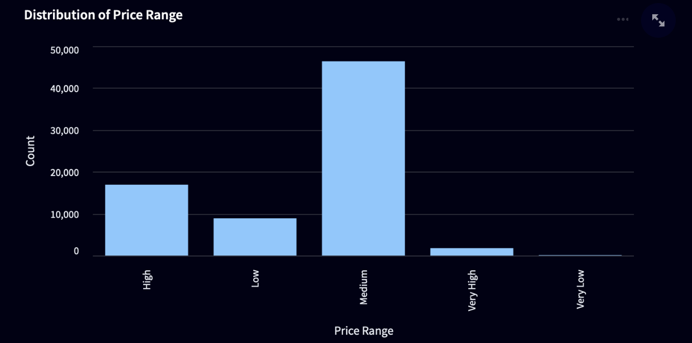

## Airbnb Price Forecasting

**Prepared for UMBC Data Science Master Degree Capstone by Dr Chaojie (Jay) Wang**

Author - **Praveen Chandanala**

Univesity ID - **EC20816**

**Github - [github.com/SNPraveenCh](https://github.com/SNPraveenCh/UMBC-DATA606-Capstone)**

**Linkedin - [linkedin/snpraveen-chandanala](https://www.linkedin.com/in/snpraveen-chandanala/)**

**Ppt - [Powerpoint presentation file](https://docs.google.com/presentation/d/1X6WV_-SCpRyy6ChQ5uPrGB_IJWEx4HD2Ru6vzfQqqmk/edit?usp=sharing)**

**Youtube - [Youtube video]()**

---

#### **Background**

What is it about?

- This dataset contains information related to Airbnb listings, offering valuable insights into various aspects of short-term rental properties. It includes details such as location, property type, amenities, pricing, and reviews, collected from Airbnb listings across different regions. This dataset presents an opportunity for data scientists and researchers to explore and analyze factors influencing Airbnb rental prices, understand market trends, and identify patterns in guest preferences and property characteristics. By leveraging this dataset, stakeholders in the hospitality industry can gain actionable insights to optimize pricing strategies, enhance guest experiences, and improve the overall efficiency of Airbnb hosting. Moreover, researchers can use this dataset to develop predictive models, recommendation systems, and other data-driven solutions aimed at improving decision-making processes and maximizing value for both hosts and guests in the Airbnb ecosystem.

Why does it matter?

- The dataset matters for several reasons. Firstly, it provides valuable insights into the dynamics of the short-term rental market, particularly through the lens of Airbnb listings. Understanding factors influencing rental prices and property characteristics can benefit various stakeholders, including property owners, travelers, and policymakers. Property owners can use the insights gained from the dataset to optimize pricing strategies, attract more guests, and maximize revenue. Travelers can make more informed decisions when selecting accommodations based on factors such as location, amenities, and pricing trends. Policymakers can leverage this data to develop regulations and policies that promote fair competition, consumer protection, and sustainable growth in the short-term rental industry. Overall, the dataset serves as a valuable resource for analyzing market trends, driving informed decision-making, and fostering innovation in the hospitality sector.

What are your research questions?

- What are the key factors influencing Airbnb rental prices?
- Are there any seasonal trends or patterns in Airbnb rental prices?

---

#### **Data** 

- Data Source – **[Kaggle/airbnb-price-dataset](https://www.kaggle.com/datasets/rupindersinghrana/airbnb-price-dataset)**
- Data Size – **101.5 MB**
- Data Shape – **Rows : 74111 , Columns : 29**
- Time Period – **2008 to 2017**
- What does each row represent? – **A property ( House, Apartment, Townhouse)**
- Data Columns

| No. | Variable               | Type     |
|-----|------------------------|----------|
| 1   | Id                     | int64    |
| 2   | log_price              | float64  |
| 3   | property_type          | object   |
| 4   | room_type              | object   |
| 5   | amenities              | object   |
| 6   | accommodates           | int64    |
| 7   | bathrooms              | float64  |
| 8   | bed_type               | object   |
| 9   | cancellation_policy    | object   |
| 10  | cleaning_fee           | bool     |
| 11  | city                   | object   |
| 12  | description            | object   |
| 13  | first_review           | object   |
| 14  | host_has_profile_pic   | object   |
| 15  | host_identity_verified | object   |
| 16  | host_response_rate     | object   |
| 17  | host_since             | object   |
| 18  | instant_bookable       | object   |
| 19  | last_review            | object   |
| 20  | latitude               | float64  |
| 21  | longitude              | float64  |
| 22  | name                   | object   |
| 23  | neighbourhood          | object   |
| 24  | number_of_reviews      | int64    |
| 25  | review_scores_rating   | float64  |
| 26  | thumbnail_url          | object   |
| 27  | zipcode                | object   |
| 28  | bedrooms               | float64  |
| 29  | beds                   | float64  |
| 30  | price_range            | object   |

- Which variable/column will be your target/label in your ML model? – **price_range**
- Which variables/columns may be selected as features/predictors for your ML models? - **'accommodates', 'bedrooms', 'bathrooms', 'number_of_reviews','review_scores_rating','beds','property_type','neighbourhood','city','room_type','bed_type','cancellation_policy','cleaning_fee'**

#### **Exploratory Data Analysis**

##### **Data Pre Processing**
- There are lot of missing values in our dataset. Imputing missing values is crucial to ensure that the dataset is complete and usable for analysis or modeling purposes. So we're using various methods to impute missing values for different columns based on certain criteria like mode or mean.
- For columns like 'bathrooms', 'bedrooms', 'beds', 'host_response_rate', 'host_has_profile_pic', 'host_identity_verified', 'host_since', and 'zipcode' we're using mode imputation and for the columns like 'neighbourhood', 'thumbnail_url', 'first_review' and 'last_review' which have string as value we are replace it with empty string ''.

##### **Data Visualization**

- The above graph represent the distribution of listings by price_range which is our target variable. We can clearly see that most number of listings come under medium category. Also we can observe that there is class imbalance within our target variable.

- The above graph represents the top neighborhoods with the highest average price of listings in the United States. The most expensive neighborhood on the list is Wilmington.

- The above graph represents distribution of listings by City. The City with most number of listings is NYC (New York City).

- The above graph represents the Average price of listings by City. The City with highest average price of listings is SF (San Fransico).
- 
- The above graph represents distribution of listings by Room Type. From the graph we can say most number of listings come under 'Entire home/Apt' category.

- Above graph represents the corelation matrix of numerical features in our dataset.

- The scatter plot shows the relationship between the number of reviews a product has and its listing price. We can observe that if the numer of reviews are more then the price is less. This maybe because if an appartment has been listed in the airbnb for a long period of time, ofcourse it might have more number of reviews and since it is an old appartment the price maybe low. Also if listing is new there might be high price on it with less number of reviews.

#### **Model Training**
- The dataset X (features) and y (target) are split into training and testing sets using the train_test_split function. First, it splits the data into training and validation sets (X_train_val, y_train_val) and a test set (X_test, y_test) with a test size of 20%. Then, the training set is further split into training and validation subsets (X_train, y_train) and (X_val, y_val) with a validation size of 25% of the original data
- We trained the training dataset using Logistic Regression, Random Forest Classifier, Decision Tree Classifier. And also applied Gridsearch for hyperparameter tuning.
- Since there is class imbalance in the target variable, we are using F1 score as our evaluation metric.
- By evaluating their performance on the test and validation set based on our evaluation metric which is F1 score, the best performing classification model among these is Random Forest Classifier with F1 score of 69.9%.
  
#### **Application of the Trained Models**
- We are creating a web application for our project using streamlit. Streamlit is an open-source Python library that allows you to create interactive web applications for data science and machine learning projects with ease. It simplifies the process of building web applications by providing a simple and intuitive interface, allowing developers to focus on data exploration, visualization, and model deployment without dealing with the complexities of web development.
- Streamlit is well-suited for a wide range of use cases, including:
  - Data exploration and visualization
  - Dashboarding and reporting
  - Prototyping machine learning models
  - Building interactive demos and tutorials
  - Creating custom web-based tools for data analysis and decision-making
- We created two different streamlit applications. One for Data Visualization and other for predicting Airbnb prices by giving custom input using our well performed model.

#### **Future Work**
- The model's accuracy can be further improved by incorporating additional features and using more advanced machine learning techniques.
- Explore the impact of temporal features like seasonality and holidays on listing prices.
- The Streamlit application is a basic prototype and can be enhanced with additional functionalities.

#### **Conclusion**
In this project, we investigated factors influencing Airbnb rental prices using a publicly available dataset from kaggle on Airbnb listings spanning from 2008 to 2017.  Through data preprocessing, visualization, and model training, we gained several key insights:
- In terms of model performance, the Random Forest Classifier emerged as the top-performing model, achieving an F1 score of 69.9%. This model demonstrated robust predictive capabilities, enabling us to forecast Airbnb rental prices with reasonable accuracy.
- We used the Streamlit framework to develop interactive web applications for data visualization and price prediction using our trained model. These applications provide users with intuitive interfaces for exploring insights from the dataset and obtaining personalized price estimates for Airbnb listings

#### **References**
